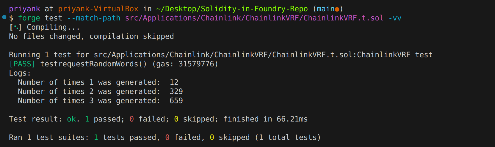

# ChainlinkVRF.t.sol

> 💻 The code corresponding to this page can be found on Github at [ChainlinkVRF.t.sol](https://github.com/Genesis3800/Solidity-in-Foundry-Repo/blob/main/src/Applications/Chainlink/ChainlinkVRF/ChainlinkVRF.t.sol) 💻

Create a file named `ChainlinkVRF.t.sol` inside your Foundry project.

To test our VRF contract using the `VRFCoordinatorV2Mock`, set up the test file with the following imports:

```solidity
// SPDX-License-Identifier: UNLICENSED
pragma solidity ^0.8.19;

import "forge-std/Test.sol";
import {VRFCoordinatorV2Mock} from "@chainlink/v0.8/mocks/VRFCoordinatorV2Mock.sol";
import {ChainlinkVRF} from "./ChainlinkVRF.sol";
```

Next, initialize a contract named `ChainlinkVRF_test`:

```solidity
contract ChainlinkVRF_test is Test {

}
```

We need to declare a few state variables:

```solidity
    // Initializing the contract instances
    ChainlinkVRF public chainlinkVRF;
    VRFCoordinatorV2Mock public vrfCoordinatorV2Mock;

    // These variables will keep a count of the number of times each
    // random number number was generated
    uint counter1; uint counter2; uint counter3;
```

The `counter1`, counter2` and `counter3` variables will keep a count of the number of times each of the respective random numbers was generated.
Now let us define the `setUp()` function to set up the initial state:

```solidity
    function setUp() public {
        vrfCoordinatorV2Mock = new VRFCoordinatorV2Mock(100000000000000000, 1000000000);
        uint64 subId = vrfCoordinatorV2Mock.createSubscription();

        //funding the subscription with 1000 LINK
        vrfCoordinatorV2Mock.fundSubscription(subId, 1000000000000000000000);

        chainlinkVRF = new ChainlinkVRF(subId, address(vrfCoordinatorV2Mock));
        vrfCoordinatorV2Mock.addConsumer(subId, address(chainlinkVRF));
    }
```

We do a few things here:

1. We initialize a new `VRFCoordinatorV2Mock` contract with some dummy values.
2. Then we programmatically create a new subscription and fund it with 1000 LINK tokens.
3. Next, we initialize a new instance of the `ChainlinkVRF` contract.
4. Finally, we add the `ChainlinkVRF` contract as an approved consumer of the subscription we created earlier.

Let us now create a `testrequestRandomWords()` function to check if our contract is consuming the VRF service correctly.
This will however be a slightly different test than the ones we have written before.

This function will not have an assertion that it may or may not pass.
Test functions written without any assertions **always** pass. We will however use the `console2` contract from Forge's test suite to log out the random numbers generated by our contract.

We can check how many times each number was generated by looking at the `counter1`, `counter2` and `counter3` variables.
This will help us see if the probability of the numbers being generated is along the desried lines.

```solidity
function testrequestRandomWords() public {

        for(uint i = 0; i < 1000; i++)
        {                    
            uint256 requestId = chainlinkVRF.requestRandomWords();
            vrfCoordinatorV2Mock.fulfillRandomWords(requestId, address(chainlinkVRF));

            if(chainlinkVRF.number() == 1){
                counter1++;
            } else if(chainlinkVRF.number() == 2){
                counter2++;
            } else {
                counter3++;
            }   
        }

        console2.log("Number of times 1 was generated: ", counter1);
        console2.log("Number of times 2 was generated: ", counter2);
        console2.log("Number of times 3 was generated: ", counter3);
    }
```

I can run the test file with this command:

```bash
forge test --match-path src/Applications/Chainlink/ChainlinkVRF/ChainlinkVRF.t.sol -vv
```

Although the exact command may vary on how you have set up your project.
Again, this test will always pass since it does not have any assertions.

However we can derive conclusions by looking at the logged values.
This is what the output of the test looks like on my terminal:


