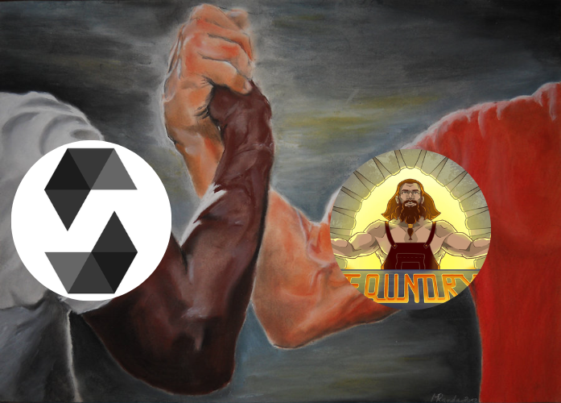

Solidity is the most popular smart contract development language at the time of writing.

I felt there was still a gap to be filled with regards to a comprehensive Solidity book, that starts from scratch and introduces beginners to the latest tech from the very beginning.

This [mdbook](https://github.com/rust-lang/mdBook) will start from a barebones *hello world* contract, and will increase in complexity, as is the case with other books that teach a programming language.

Foundry is a powerful framework that allows us to build, test and deploy smart contracts to the blockchain straight out of the command line. This book will be using Foundry's tooling to write and test our smart contracts.

Most, if not all chapters in this book will contain at least two sections:
1. A section explaining the actual smart contract, and the required concepts.
2. Another one dedicated to writing a corresponding test, no matter how simple, using Foundry's toolkit.

There are two main ways of deriving value from this book:
1. For beginners who just want to learn Solidity but don't want to pick up Foundry for now, you can just read the first section of each chapter, and try to replicate it in the [Remix IDE](https://remix.ethereum.org/).
In case you find the Remix IDE intimidating, you can go through [this lesson](https://youtu.be/umepbfKp5rI?t=8138) from Patrick Collins' 32-hour course.
2. For folks interested in getting started with Foundry, I recommend you follow all sections of each chapter.

Here are some resources that this book is inspired by:
1. [The Rust Book.](https://doc.rust-lang.org/book/)
2. [The Foundry Book.](https://book.getfoundry.sh/)
3. [Solidity-by-example.](https://solidity-by-example.org/)
4. [Patrick Collins' 32-hour Foundry course.](https://youtu.be/umepbfKp5rI)

**TL;DR:** This project is an inspired twist on other sources of learning Solidity. I will be starting from scratch assuming no experience with Solidity. I do however expect a basic understanding of how blockchains work.

> ⚠️  **Full disclosure**
>
> I am not in any way associated with the core Foundry team, and don't wanna be seen as piggybacking
> off of them.
> This mdbook is a personal labour of love, with the final goal being for this to
> one day serve as a free, comprehensive and open-sourced resource  for wanabee Solidity devs.