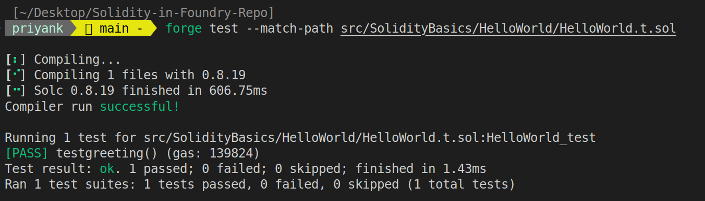

## HelloWorld.t.sol

Foundry allows us to write tests using Solidity, allowing Solidity developers the comfort of not having to use a language they are not comfortable with.

Each '*test*' is a single function within a smart contract. These typically have a condition that has to be satisfied.
If the condition is true, the test passes; otherwise it fails.

Since `HelloWorld.t.sol` is basically another Solidity file from Forge's perspective, it will begin like other Solidity files do:

```cpp
// SPDX-License-Identifier: MIT

pragma solidity ^0.8.19;
```
Next, we import two smart contracts into this file:

```cpp
import "forge-std/Test.sol";
import "./HelloWorld.sol";
```
1. The first import is the Forge test library, which contains the `Test` contract. Foundry lets us use its' testing suite by exposing functions from within the test contract to us.
2. The second import is the smart contract we are testing. 

> 📝  **Note:**
>Please note that Solidity as a language supports inheritance, but not all smart contract languages do so.
>Do not worry too much about how inheritance works, we will look into it in more detail later on.

Next, we initialize the `HelloWorld_test` contract like this:

```cpp
contract HelloWorld_test is Test {

}
```
This is the contract that will contain all of our tests. We inherit from the `Test` contract, which allows us to use the testing suite.

Next, we initialize a test function within the contract like this:

```cpp
    function testgreeting() public {
    }
```

Within the function, create a new instance of the HelloWorld contract like this:

```cpp
   HelloWorld helloWorld = new HelloWorld();
```
We can now use the `helloWorld` variable to access the functions within the `HelloWorld` contract.
Lastly we use `assertEq` to assert equality between two values. If the values are equal, the test passes; otherwise it fails.
This is what the test function should look like:

```cpp
    function testgreeting() public {
        HelloWorld helloWorld = new HelloWorld();
        assertEq(helloWorld.greeting(), "Hello World");
    }
```

Now understand this carefully.
We use Forge to compile and test our smart contracts. Forge compiles all smart contracts in a codebase indiscriminately. This means that it will compile all smart contracts, including the test contracts.

Forge distingueshes the indiviual test functions by looking at function names. Any function beginning with the string *"test"* is executed as a test function.
This means that *"testgreeting"* is a valid name for a test function, but *"greetingtest"* is not.

Make sure to save your files and compile them using the build command. We can now execute the test function by running the following command:

```sh
forge test --match-path src/SolidityBasics/HelloWorld/HelloWorld.t.sol
```

We can use the match path flag to specify which test file we want to run. This is useful when we have multiple test files in our codebase, and don't want to run all of them.

This is what your terminal should look like right now:



And that's it!<br />
This is all there is to writing a basic Solidity test in Foundry.
Now there's a variety of different ways to write more complex and comprehensive tests, but we will look into those later on, when we deal with more complex smart contracts.